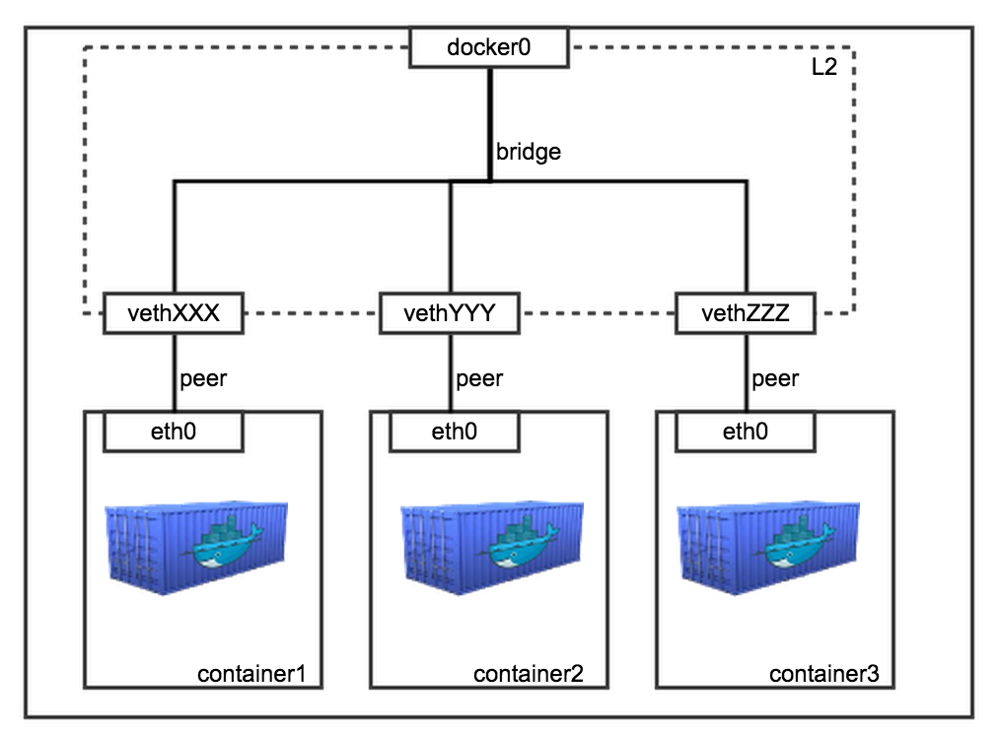

# Docker Network

## docker0
Docker를 설치 후 Host의 네트워크를 확인해보면 docker0 라는 장치가 확인된다.<br>

**docker0** : Docker가 실행되면서 기본적으로 생성되는 가상의 네트워크 장치. 
```bash
ubuntu@ip-172-31-27-233:~$ ifconfig docker0
docker0: flags=4099<UP,BROADCAST,MULTICAST>  mtu 1500
        inet 172.17.0.1  netmask 255.255.0.0  broadcast 172.17.255.255
        inet6 fe80::42:b6ff:fe7d:6827  prefixlen 64  scopeid 0x20<link>
        ether 02:42:b6:7d:68:27  txqueuelen 0  (Ethernet)
        RX packets 158141  bytes 24181886 (24.1 MB)
        RX errors 0  dropped 0  overruns 0  frame 0
        TX packets 173954  bytes 1059934458 (1.0 GB)
        TX errors 0  dropped 0 overruns 0  carrier 0  collisions 0
```
`inet 172.17.0.1  netmask 255.255.0.0  broadcast 172.17.255.255`

docker0 ip는 172.17.0.1이며 docker0에 연결되는 장치들은 172.17.0.0/16 대역에 할당될 것임을 알 수 있다.

<br>

네트워크 장치에는 여러가지 역할/모드를 부여할 수 있는데, docker0는 브리지 모드로 동작한다. 
```bash
# 브리지 확인
ubuntu@ip-172-31-27-233:~$ sudo brctl show
bridge name     bridge id               STP enabled     interfaces
br-c7715a661820         8000.024297514e19       no
br-c9fc4ea67d9c         8000.02421a15def3       no
docker0         8000.0242b67d6827       no
```
<br>

컨테이너는 외부와 통신하기 위해 2개의 네트워크 인터페이스를 함께 생성한다.

하나는 컨테이너 내부 Namespace에 할당되는 eth0 이름의 인터페이스이고, 다른 하나는 호스트 네트워크 브리지 docker0에 바인딩 되는 vethXXX 이름 형식의 veth 인터페이스이다. (veth는 virtual eth를 의미)

컨테이너의 eth0 인터페이스와 호스트의 veth 인터페이스는 서로 연결되어 있다.
컨테이너가 실행될 때마다 vethXXX라는 이름의 인터페이스가 attach되는 형태이다.
```bash
# ubuntu 컨테이너 실행
ubuntu@ip-172-31-27-233:~$ docker run -d -it ubuntu:latest /bin/bash

ubuntu@ip-172-31-27-233:~$ sudo docker ps
CONTAINER ID   IMAGE           COMMAND       CREATED         STATUS         PORTS     NAMES
df0f3a2a09d1   ubuntu:latest   "/bin/bash"   9 seconds ago   Up 8 seconds             reverent_sanderson

# docker0 브리지 확인 - veth 가상네트워크 장치가 연결됨
ubuntu@ip-172-31-27-233:~$ sudo brctl show docker0
bridge name     bridge id               STP enabled     interfaces
docker0         8000.0242b67d6827       no              vethc3f8021

# ip link를 통해서도 확인 가능
ubuntu@ip-172-31-27-233:~$ ip link
1: lo: <LOOPBACK,UP,LOWER_UP> mtu 65536 qdisc noqueue state UNKNOWN mode DEFAULT group default qlen 1000
    link/loopback 00:00:00:00:00:00 brd 00:00:00:00:00:00
2: eth0: <BROADCAST,MULTICAST,UP,LOWER_UP> mtu 9001 qdisc fq_codel state UP mode DEFAULT group default qlen 1000
    link/ether 06:8b:98:dc:17:de brd ff:ff:ff:ff:ff:ff
3: docker0: <BROADCAST,MULTICAST,UP,LOWER_UP> mtu 1500 qdisc noqueue state UP mode DEFAULT group default
    link/ether 02:42:b6:7d:68:27 brd ff:ff:ff:ff:ff:ff
34: br-c9fc4ea67d9c: <NO-CARRIER,BROADCAST,MULTICAST,UP> mtu 1500 qdisc noqueue state DOWN mode DEFAULT group default
    link/ether 02:42:1a:15:de:f3 brd ff:ff:ff:ff:ff:ff
107: br-c7715a661820: <NO-CARRIER,BROADCAST,MULTICAST,UP> mtu 1500 qdisc noqueue state DOWN mode DEFAULT group default
    link/ether 02:42:97:51:4e:19 brd ff:ff:ff:ff:ff:ff
147: vethc3f8021@if146: <BROADCAST,MULTICAST,UP,LOWER_UP> mtu 1500 qdisc noqueue master docker0 state UP mode DEFAULT group default
    link/ether 06:82:37:7b:a3:4f brd ff:ff:ff:ff:ff:ff link-netnsid 0

# 컨테이너에서 ifconfig - eth0를 확인해보면
# 172.17.0.2에 할당됨을 알 수 있다.
ubuntu@ip-172-31-27-233:~$ sudo docker exec -it reverent_sanderson /bin/bash
root@df0f3a2a09d1:/# ifconfig
eth0: flags=4163<UP,BROADCAST,RUNNING,MULTICAST>  mtu 1500
        inet 172.17.0.2  netmask 255.255.0.0  broadcast 172.17.255.255
        ether 02:42:ac:11:00:02  txqueuelen 0  (Ethernet)
        RX packets 2477  bytes 20877422 (20.8 MB)
        RX errors 0  dropped 0  overruns 0  frame 0
        TX packets 2194  bytes 151240 (151.2 KB)
        TX errors 0  dropped 0 overruns 0  carrier 0  collisions 0

# 컨테이너에서 라우팅테이블을 확인해보면
# Gateway가 172.17.0.1 인데, 즉 컨테이너 내부의 모든 패킷이 호스트의 docker0를 통해 출입한다는 것을 알 수 있다.
ubuntu@ip-172-31-27-233:~$ sudo docker exec reverent_sanderson route
Kernel IP routing table
Destination     Gateway         Genmask         Flags Metric Ref    Use Iface
default         ip-172-17-0-1.u 0.0.0.0         UG    0      0        0 eth0
172.17.0.0      0.0.0.0         255.255.0.0     U     0      0        0 eth0
```
<br>

즉, docker0 브리지는 veth 가상 인터페이스와 호스트의 eth0 인터페이스를 이어주는 중간 다리 역할을 한다. 

그리고 컨테이너 안의 eth0 인터페이스는 veth 가상 인터페이스를 통해 외부와 통신할 수 있게 되는 것이다.




<br>

> [ 참고 ]
> 
> **eth0** : 리눅스에서 장착된 랜카드를 나타냄 (/dev/eth0, /dev/eth1...)
> 
> **브리지** : 호스트의 네트워크와 게스트의 네트워크를 브리지(연결)하여 게스트 컴퓨터가 네트워킹하는 방식. 즉 호스트와 게스트를 하나로 연결하여 두 개의 네트워크를 마치 하나의 네트워크처럼 쓰는 것이다.
>
>이렇게 게스트와 호스트의 네트워크가 브릿지 됨으로써 호스트 네트워크와 게스트 네트워크가 서로 동등한 수준의 네트워크를 제공받게 됨.
>
>호스트와 게스트가 서로 동등한 자격을 가지기 때문에 게스트 컴퓨터에도 호스트 컴퓨터와 같이 공인(Public) IP를 할당하거나 호스트 컴퓨터가 사설망에 연결된 경우 호스트와 동일한 IP 대역을 할당할 수 있다.

<br>

## Container Network 방식


컨테이너를 생성할 때 지원되는 네트워크 방식에는 브리지(bridge), 호스트(host), 논(none) 등이 있다.

```bash
ubuntu@ip-172-31-27-233:~$ sudo docker network ls
NETWORK ID     NAME             DRIVER    SCOPE
3ab69e92803f   bridge           bridge    local
c9fc4ea67d9c   hadoop3_bridge   bridge    local
58f4a3bc263c   host             host      local
7eb3dff77144   none             null      local
c7715a661820   redis-net        bridge    local
```

<br>
default 설정은 bridge 방식인데, 다른 방식으로 컨테이너를 생성하고 싶다면 --net 을 이용하여 option을 주면 된다.

`root@~~# docker run --net=NETWORK_TYPE ...`


<br>

---

```
참고한 블로그

https://alsrbdmsco0409.tistory.com/244
https://linux.systemv.pe.kr/docker-%EB%84%A4%ED%8A%B8%EC%9B%8C%ED%81%AC-%EC%9D%B4%ED%95%B4/
https://jonnung.dev/docker/2020/02/16/docker_network/
https://bluese05.tistory.com/15
```